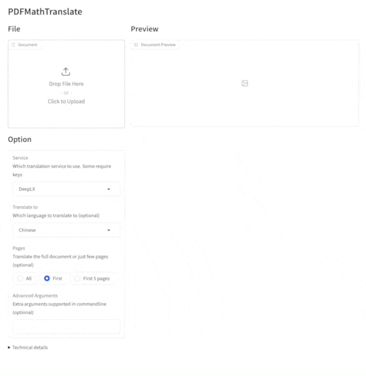
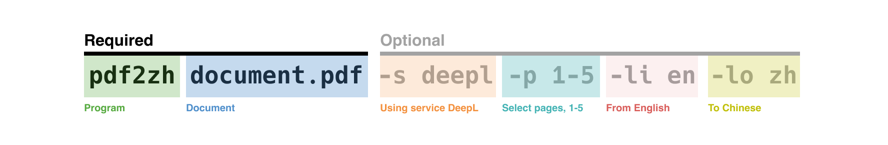

**大家好，我是雷达君。**

读论文有多痛，做过科研的人都懂。好不容易找到一篇顶会论文，打开一看满屏英文术语、公式符号、双栏排版。复制进某个翻译软件，出来的东西更灾难：公式变成乱码，图表飞到奇怪的位置，双栏结构塌成一大段没有断句的文字，连参考文献的编号都对不上。本来二十分钟能读懂的一篇论文，光"人肉修复"翻译稿就耗掉一个小时。

更尴尬的是，市面上不缺"PDF 翻译"工具，但绝大多数做的是"抽文本 → 翻译 → 重新排版"。翻译质量再高，版式一毁，公式和图表的阅读体验直接归零。对数学、物理、计算机这些"公式就是正文"的学科来说，这几乎是致命伤。

今天雷达君要说的这个项目，就是专门来治这个病的：PDFMathTranslate，一个能"完整保留排版"的 PDF 论文翻译工具。它在 GitHub 上已经拿到 36,000+ Star，今天一天又涨了近 800 星，而且它的方法还被 EMNLP 2025（自然语言处理顶会之一）官方 Demo 论文收录——学术圈自己下场给这个工具盖了章。

## 01 ｜核心逻辑

PDFMathTranslate 的核心思路可以用一句话概括：**先把页面"看懂"，再动手翻译，最后把译文按原坐标塞回去**。

传统翻译工具处理 PDF 时，本质上是把 PDF 当成一大段纯文本流，抽出来、翻译、再排版。问题就出在"再排版"这一步——原始 PDF 里的版面信息（谁在左栏、谁在右栏、公式在哪、图注跟着哪张图）在这个过程中全丢了。PDFMathTranslate 反其道而行之：它先用版面检测模型（DocLayout-YOLO）对每一页做"解剖"，识别出文本块、公式块、图表块和页眉页脚的精确位置，然后分块提取、分块翻译，最后用 PyMuPDF 把译文按原来的坐标精确嵌入回 PDF。原文的排版骨架从头到尾没有被动过，翻译只是"换掉字"。

公式是它最被称道的地方。数学公式会被单独识别为一个块，翻译过程中保持 LaTeX 语义、不破坏符号结构，嵌入时还会做字体子集化处理，保证公式在译文里依然清晰锐利，不会重排，更不会糊成一张图。翻译完成后你会得到两个文件：`xxx-mono.pdf`（纯译文版）和 `xxx-dual.pdf`（中英对照版），后者把原文和译文放在同一页对照显示，读文献时既能啃译文又能随时核对原文，非常顺手。

架构上它也不是一锤子买卖。目前默认的是稳定成熟的 v1 内核（fast 模式），同时官方在并行推进 v2 内核（`--mode precise`，基于独立仓库 PDFMathTranslate-next），并接入了 BabelDOC 作为实验性新后端。翻译引擎层面完全解耦：Google（默认、免费）、DeepL、OpenAI、Ollama（本地大模型）、MiniMax 等随意切换，你手头有什么就用什么。


## 02 ｜硬核功能盘点

> 🔗GitHub 地址：https://github.com/PDFMathTranslate/PDFMathTranslate

- **六大入口全平台覆盖**：pip 一键安装的 CLI、浏览器图形界面（`pdf2zh -i`）、Docker 镜像、Windows 免安装绿色版、Zotero 文献管理插件，以及官方免费在线服务 pdf2zh.com（另有 HuggingFace / ModelScope 在线 Demo）。无论你是命令行党、GUI 党还是纯在线用户，都有对应的打开方式。
- **翻译引擎全家桶**：Google 免费引擎开箱即用，DeepL、OpenAI、MiniMax 等商业引擎一个 `-s` 参数就能切换，还支持 Ollama 本地模型——敏感文档可以做到完全离线翻译，数据不出本机。
- **细粒度控制选项**：`-p` 指定页码做部分翻译，`-f/-c` 用正则排除不想翻译的内容（比如参考文献、致谢），`--dir` 一键批量翻译整个目录，`-t` 多线程加速，`--prompt` 自定义翻译提示词。这些参数让它在"批量处理几百篇论文"的场景里也扛得住。
- **在线 PDF 直译**：支持直接把 arXiv 论文链接丢进去翻译，不用先下载到本地，`pdf2zh http://arxiv.org/paper.pdf` 一条命令搞定。
- **MCP 协议支持**：`--mcp`（标准输入输出模式）和 `--sse`（HTTP 流模式）可以把翻译能力直接接入 AI Agent 工作流，让翻译成为智能体工具链里的一环——这对正在折腾"AI 辅助科研"流水线的人是个大杀器。
- **团队部署能力**：`--share` 生成公网分享链接，`--authorized` 配合用户名密码做访问控制——把 GUI 部署到内网服务器，就能给整个课题组提供统一的翻译入口。




## 03 ｜典型场景和避坑

**典型场景一：研究生读文献的日常**

文献管理工具 Zotero 里装上 PDF2zh 插件，选中一篇英文论文右键一点，几十秒后一篇中英对照版 PDF 就躺在条目旁边。读不懂的段落抬头看一眼原文，公式和图表的对应关系一目了然。不少科研党反馈，这套"Zotero + PDFMathTranslate"的组合拳，把组会前读文献的时间直接砍半。

**典型场景二：团队批量翻译技术文档**

内部技术文档、专利、合同这类"既敏感又量大"的资料，用 Docker 在私有服务器上部署一个实例，配合 Ollama 本地模型和 `--dir` 批量参数，整目录整目录地处理。文档不出内网，翻译质量可控，还能用 `--authorized` 管住访问权限，比把资料传给任何在线服务都安心。

**避坑指南**

- 第一，**Python 版本有硬性要求**：必须是 3.11 到 3.12，太新或太旧都装不上或跑不起来，建议用 `uv` 或 conda 建一个干净的 3.12 环境。
- 第二，**首次运行要联网下载版面检测模型**（DocLayout-YOLO），国内网络环境如果卡住，先设置 `HF_ENDPOINT=https://hf-mirror.com` 走镜像再跑。
- 第三，**免费引擎有天花板**：默认的 Google 引擎免费但质量随内容波动，遇到公式密集、术语生僻的文档，建议切到 DeepL 或 OpenAI 引擎，并在发布前人工校对一遍关键公式和专有名词。
- 第四，**复杂版面别死磕 fast 模式**：遇到跨栏、跨页语义断裂的情况，可以试试实验性的 `--mode precise`（v2 内核）或 `--babeldoc` 后端，它们对边缘 case 的兼容性更好；但两者仍在快速迭代，生产使用前先拿几篇文档做对比测试。




## 04 ｜上手教程

最快三分钟跑通，前提是 Python 3.11-3.12 环境：

```bash
# 1. 安装
pip install pdf2zh

# 2. 翻译一篇论文（输出 paper-mono.pdf 纯译文 + paper-dual.pdf 中英对照）
pdf2zh paper.pdf

# 3. 想换翻译引擎（如 OpenAI）
pdf2zh paper.pdf -s openai

# 4. 打开浏览器图形界面（自动跳转 http://localhost:7860）
pdf2zh -i

# 5. 批量翻译整个目录
pdf2zh --dir ./papers/
```

不想折腾环境的，两条 Docker 命令直接起：

```bash
docker pull byaidu/pdf2zh
docker run -d -p 7860:7860 byaidu/pdf2zh
```

打开 `http://localhost:7860/` 即可使用网页版。如果只是想先试试效果，官方免费在线服务 pdf2zh.com 无需安装直接可用（在线 Demo 算力有限，大批量任务请本地部署）。

## 05 ｜总结

PDFMathTranslate 解决的是一个非常"实"的问题：学术文档翻译里，翻译质量和排版保真从来都是鱼和熊掌，它用"版面检测 + 分块翻译 + 原位嵌入"的技术路线把两者焊在了一起。36K Star 的热度、EMNLP 2025 Demo 论文的学术背书、以及 22 万+ 的累计下载量，都说明这不是又一个昙花一现的玩具，而是真正被科研社区用脚投票选出来的工具。

当然也要泼点冷水：v2 内核和 BabelDOC 后端还贴着"实验"标签，免费翻译引擎的质量有波动，极复杂的版面（比如多栏表格混排）偶尔还是需要人工微调。它不是魔法，但确实把"论文翻译"这件事的效率上限往上抬了一大截。

如果你正在为读论文头疼，或者需要给团队搭一个私有的文档翻译服务，去 GitHub 给这个项目点个 Star，花五分钟装上试一篇——大概率你会和那 3.6 万人一样，用完回不去了。

---
📌 **往期推荐**

- [GitHub 9.2K Star！大模型推理的"Redis"：把重复计算砍掉 90%，TTFT 直降 3-10 倍](https://mp.weixin.qq.com/s/Ua0kN4A2G_PZLqwug5UxDw)
- [GitHub 5K Star！AI Agent 技能安检员登场：NVIDIA 开源 SkillSpector，专治"恶意技能"乱入](https://mp.weixin.qq.com/s/aeeGYhFfG8uKWrO-Sjwn1g)
- [GitHub 32K Star！Netflix 开源的工作流大脑：Tesla、LinkedIn、摩根大通都在用](https://mp.weixin.qq.com/s/tuFGo_34FFP1tHLIeIyKJA)

如果觉得有用，可以点个 **关注** 和 **推荐**，也欢迎 **转发**

