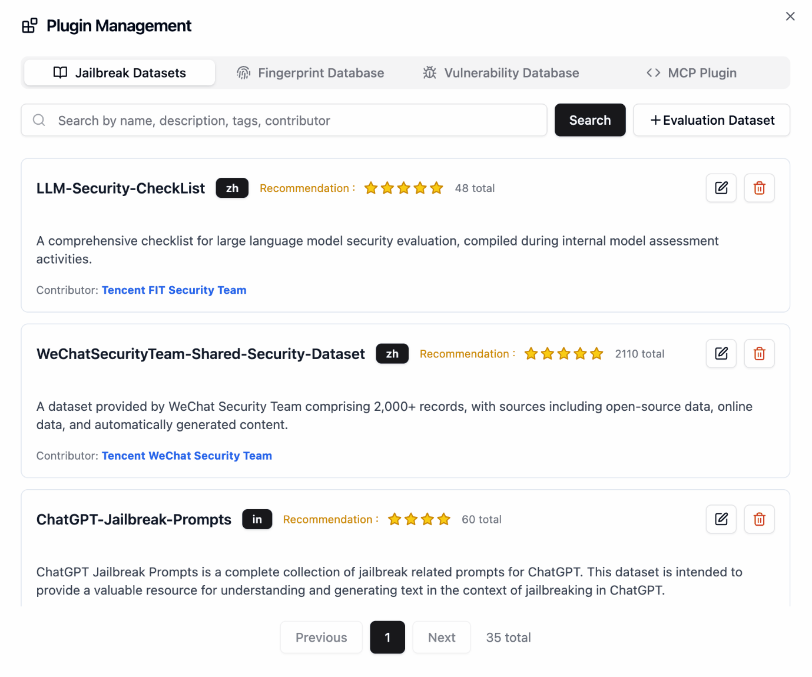

**大家好，我是雷达君。**

最近有个扎心的问题在朋友圈刷屏：你花三个月调出来的 AI Agent，上线第一天就被一段「精心设计」的提示词套出了数据库密码。更魔幻的是，你甚至不知道它是怎么泄露的——回看日志，每一步调用都「合法」，每个权限都「正常」。

这不是段子。当 AI 从聊天框变成会调用工具、读写文件、连接外部服务的智能体之后，攻击面突然扩大了十倍：提示词注入、越狱攻击、恶意 MCP 服务、被投毒的 Agent 技能、AI 基础设施里那些没人管的 CVE 漏洞……传统的 Web 扫描器和渗透测试工具，面对这一整套新攻击面基本抓瞎。安全团队想自检，却发现市面上的 AI 安全工具要么是论文 Demo，要么贵得离谱。

今天要聊的 Tencent/AI-Infra-Guard（简称 A.I.G），就是冲着这个痛点来的——它是腾讯朱雀实验室（Zhuque Lab）开源的全栈 AI 红队测试平台，把 Agent 扫描、Skill 扫描、MCP 扫描、AI 基础设施漏洞扫描和越狱评估五大能力装进了一个免费开源的平台里，上过 Black Hat EU 的 Arsenal 展台。

## 01 ｜核心逻辑

A.I.G 的设计思路很直接：**把「AI 红队测试」从安全专家的手工活，变成一条人人都能跑的自动化流水线**。

传统 AI 安全评估是什么样的？安全研究员要分别找工具：测提示词注入用一个脚本，测 MCP 服务安全用另一个，扫 AI 框架漏洞还得自己维护 CVE 库。结果就是每家公司的 AI 应用上线前，安全自检基本靠运气。A.I.G 的做法是把这些全塞进一个平台：你只需要把目标（一个 Agent 工作流、一个 MCP 地址、一个 AI 服务的 IP）填进去，它自动完成指纹识别、风险扫描、漏洞匹配，最后吐出一份带修复建议的报告。

支撑这套流水线的，是五个相对独立的扫描引擎。ClawScan 负责 OpenClaw 环境的安全自检（配置、技能、CVE、隐私泄露）；Agent Scan 是一个多智能体自动化扫描框架，能评估 Dify、Coze 等平台上跑的 Agent 工作流安全性；MCP 与 Skill 扫描覆盖 14 大类安全风险；AI Infra 扫描专门盯 AI 服务本身的已知漏洞；Jailbreak Evaluation 则用精心构造的数据集去「攻击」你的模型，看它会不会被绕晕。

更值得说的是它的「标尺意识」：腾讯同步开源了 SkillTrustBench 基准测试，把 Agent 技能的安全风险系统性地分成 T01-T09 九大类（指令劫持、记忆投毒、远程载荷执行、嵌入式恶意代码、提权、持久化、工具劫持、不安全依赖、不安全编码实践）。有基准才有对比，有对比才知道自己的扫描到底靠不靠谱——实测 F1 最高能到 0.9848。


## 02 ｜硬核功能盘点

> 🔗GitHub 地址：https://github.com/Tencent/AI-Infra-Guard

- **AI 基础设施漏洞扫描**：这是最容易出成果的一块。它内置了 100+ 个 AI 框架组件的指纹识别，匹配 2000+ 条已知 CVE 规则，覆盖 Ollama、ComfyUI、vLLM、n8n、Triton Inference Server 等主流组件。你把一个跑着 vLLM 的服务器地址填进去，它自动识别组件和版本，告诉你命中了哪些漏洞、严重程度如何、该怎么修。
- **Agent Scan 多智能体扫描框架**：不是简单地给 Agent 发几条恶意提示词，而是独立的、多智能体协作的自动化扫描框架，专门评估 AI Agent 工作流的安全，无缝支持 Dify、Coze 等平台。最新版还新增了 5 个 OWASP 技能和 Web 数据外泄检测，累计 10 个技能。
- **MCP 与 Skill 扫描**：针对这两年爆火的 MCP 和 Agent Skills 供应链。v4.5.2 刚加上了 .pyc 字节码绕过检测和字符集走私（charset smuggling）防御，MCP 扫描还支持动态模式下通过工具白名单防 RCE——这意味着它不只看静态代码，还会考虑运行时行为。
- **Jailbreak 越狱评估**：内置单轮 + 多轮越狱攻击，包括 Many-Shot、PAIR、GOAT、ActorAttack 四种多轮攻击手法，评估结果支持跨模型横向对比。你的模型到底是「意志坚定」还是「一推就倒」，跑一遍就有数。
- **Model & API Relay Checker**：模型指纹识别、Claude 签名验证、中转 API 黑盒审计——如果你在用第三方模型中转服务，这个能帮你判断对面是不是「真货」。
- **开放生态**：`aig-skill-scan` 可以一条 pip 命令装进企业 CI/CD 流水线；ClawHub 上发布了 EdgeOne ClawScan、Skill Scanner、AIG Scanner 三个技能，能直接把扫描能力嵌进任何 AI Agent 的工作流；还能从 OpenClaw 聊天里直接调用。




## 03 ｜典型场景和避坑

**典型场景一：AI 应用上线前的「全身体检」**

某团队要上线一个接了大模型 + MCP 文件工具 + 内部知识库的 Agent。上线前用 A.I.G 跑一遍：Agent Scan 检查工作流有没有越权路径，MCP Scan 检查文件工具有没有注入风险，再对跑 AI 服务的服务器做一轮 Infra 扫描，最后用 Jailbreak 评估确认模型不会被几轮对话绕晕。四个报告合一，直接作为安全评审的底稿。

**典型场景二：第三方 Skill/MCP 供应链安检**

现在越来越多人从各种社区直接下载现成的 Agent Skill 用。问题在于：Skill 本质上是「代码 + 指令」的混合体，恶意 Skill 可以在你不知不觉中执行远程载荷。A.I.G 的 Skill 扫描按 T01-T09 九类风险逐一检查，下载安装前先扫一遍，比事后救火强一百倍。

**避坑指南**

- 第一，A.I.G 定位是企业/个人内网自检，**目前没有认证机制，千万别部署到公网**，否则相当于把攻击工具白送人。
- 第二，AI Infra 扫描的目标要填**正在运行的服务地址**（如 `http://127.0.0.1:8000`），不是 GitHub 仓库地址，填错只会得到空报告。
- 第三，跑 Skill 扫描需要配置 `LLM_API_KEY`，记得选一个推理能力靠谱的模型，扫描质量直接跟模型挂钩。
- 第四，扫描报告是「体检单」不是「手术刀」，发现漏洞后的修复（升版本、改配置、加白名单）还是需要人来判断，别指望全自动。


## 04 ｜上手教程

Docker 环境下一分钟起服务：

```bash
# 拉取预构建镜像，快速启动
git clone https://github.com/Tencent/AI-Infra-Guard.git
cd AI-Infra-Guard
docker-compose -f docker-compose.images.yml up -d
```

启动后浏览器打开 `http://localhost:8088` 即可看到 Web 界面，选一个扫描模块、填入目标、点开始，实时查看进度和报告。

只想扫 Agent Skill 的话，pip 一条命令就能装 CLI：

```bash
pip install aig-skill-scan
export LLM_API_KEY="your-api-key"

# 扫描本地 Skill 项目目录
aig-skill-scan --repo /path/to/your/skill \
           -m deepseek-v4-flash \
           --language en \
           -o result.json
```

## 05 ｜总结

A.I.G 最大的价值，是把 AI 安全自检这件事**平民化**了。过去只有大厂安全团队才有能力做的 AI 红队测试，现在任何团队只要一台能跑 Docker 的机器，就能对自己的 Agent、MCP、Skill 和 AI 基础设施做一轮像模像样的体检。Apache 2.0 协议、免费开源、Web 界面 + 完整 API + CLI 三件套，诚意是拉满的。

当然也要泼点冷水：它没有认证机制、扫描质量依赖你配置的 LLM、漏洞库再全也追不上新漏洞的诞生速度。它不是银弹，但作为「AI 安全的第一道自检门」，目前很难找到比它更全、更顺手的免费方案。

如果你正在做 AI 应用、或者你的团队已经开始用 Agent 和 MCP，花五分钟把它跑起来，扫一遍你的系统——大概率你会发现一些「惊喜」。


