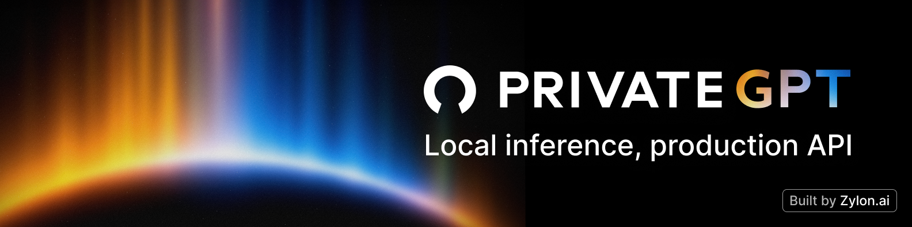
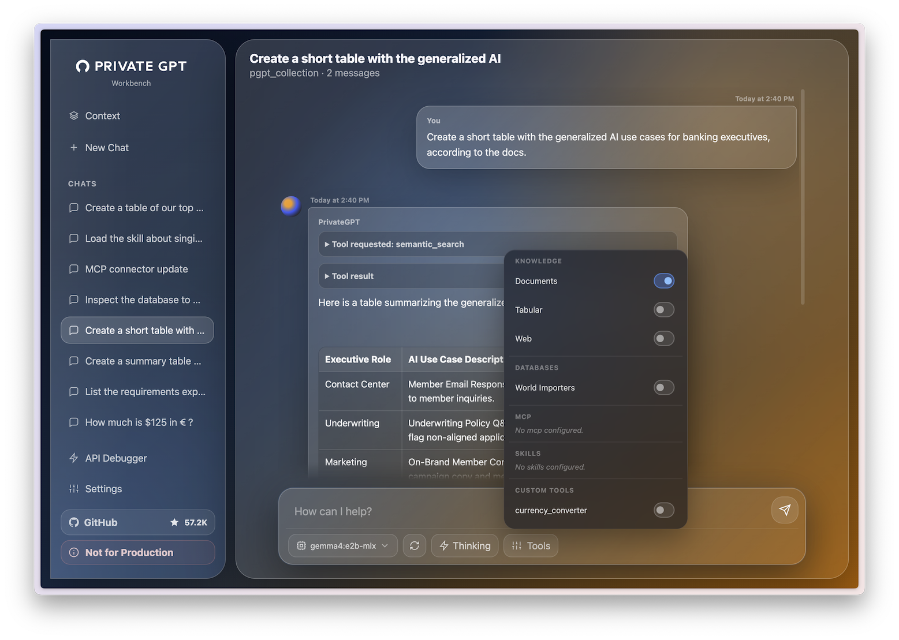
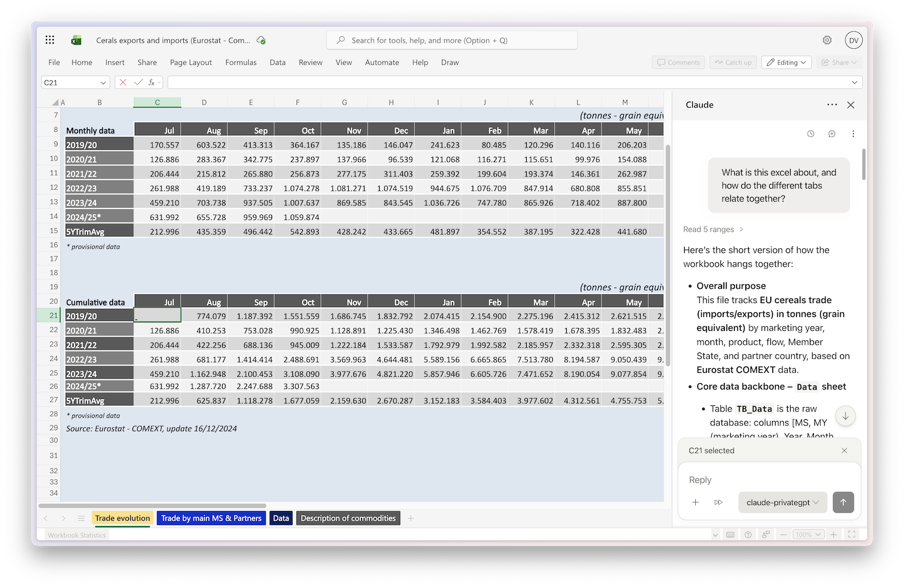

**大家好，我是雷达君。**

很多人以为，"私有化部署大模型"就是把 Ollama 装好、模型拉下来、跑起一个聊天界面。到这一步，模型确实在你机器上了，但离"能用"还差着十万八千里。

想做文档问答？你得自己拼向量库、切分、检索、引用回填。想让模型查数据库？你得自己接 text-to-sql。想让它联网搜资料、调用内部系统？又是两套协议要啃。最要命的是，这些脏活累活造完轮子之后，你还得保证它们扛得住并发、能被监控、能长期维护。数据不能出内网是合规红线，但云端 API"全家桶"的能力又馋得慌——这个二选一的困境，几乎每个做企业级私有 AI 的团队都撞过。

今天要聊的 zylon-ai/private-gpt，就是来解这道题的。它是 2023 年那个横扫 GitHub 的传奇项目 PrivateGPT 的 1.0 重生版——当年它用一个"完全离线跟文档对话"的 PoC 脚本拿下 5 万+ Star；如今它被彻底重写成一整层"应用 API 层"：在任意本地推理服务器之上，向上提供对标 Claude API 的完整应用接口。RAG、工具调用、MCP、text-to-sql、结构化输出——这些过去要自己一块块拼的东西，现在换一个 base_url 就有了。

## 01 ｜核心逻辑

PrivateGPT 的第一条设计原则是：**它不运行模型**。它把自己定义成推理层和应用层之间的"翻译层"。下面，是 Ollama、vLLM、llama.cpp、LM Studio 这类负责把模型跑起来、暴露 OpenAI 兼容端点的推理服务器；上面，是你的应用、Agent、工作流、UI。PrivateGPT 卡在中间，把"裸聊天"翻译成"完整的 AI 应用能力"。

这个定位解决了一个被忽略的问题：推理层项目（Ollama 们）回答的是"怎么把模型跑起来"，而做应用的人真正缺的是"怎么在模型之上快速做出有用的东西"。文件摄入、引用式检索、工具调用、数据库访问、MCP 连接——每一个都是成熟团队沉淀出来的工程，不是几行 demo 代码。

它的第二条原则是：**以 Claude API 为规范**。PrivateGPT 对照 Anthropic 的 API 设计逐项实现：messages、流式输出、异步批处理、token 计数、files/artifacts、带引用的检索、内置工具、自定义工具、MCP、数据库与 CSV 的结构化访问。好处很直接：你昨天写给云端 Claude 的代码，把 base_url 指向本地 PrivateGPT，几乎零改动就能跑。官方兼容性对照表里，绝大多数能力已是 ✅ 全量支持（prompt caching 和 OAuth 尚未支持）。

第三条是**生产验证**：它不是"看起来很美"的实验品——Zylon 团队的 on-premise 企业 AI 平台就构建在 PrivateGPT 之上，服务全球受监管行业的客户。




## 02 ｜硬核功能盘点

> 🔗GitHub 地址：https://github.com/zylon-ai/private-gpt

- **标准 Messages API**：流式输出、异步处理、token 计数一应俱全，任何 OpenAI 兼容推理服务器（实现 /v1/chat/completions 和 /v1/models 即可）都能接入
- **文件与工件摄入**：PDF、文档批量摄入，自动完成切分、向量化、入库
- **带引用的检索 + Agentic RAG**：回答附带出处引用，检索策略可配置，支持 agent 化的多轮检索
- **内置工具（镜像 Claude API）**：联网搜索、网页抓取、代码执行开箱即用
- **自定义工具 + MCP 连接器**：支持远程 MCP server，本地模型也能接进外部工具生态
- **数据库与 CSV 结构化访问**：内置 text-to-sql 和表格分析能力，用大白话问数据库、查表格——这一点比 Claude API 的"经工具间接访问"还进了一步
- **Embeddings 与编排**：独立的 embedding 接入 + 检索编排，把知识库链路全包了
- **Workbench UI**：内置 /ui 工作台，选模型、传文档、测引用检索、逐聊天开关工具、配置数据库/MCP/技能，还带 API Debugger 直接看请求响应——但它明确只是个演示器，API 才是本体




## 03 ｜典型场景和避坑

**典型场景一：内网知识库问答（数据不出域）**

文档资产敏感、不能上云的团队，把 PrivateGPT 指向内网的 vLLM/Ollama 集群，摄入内部知识库文档，员工通过自研前端提问，回答带引用、全程数据不出内网。相比自己从零拼 RAG，省掉的是切分、向量、检索、引用回填、评估一整套工程。

**典型场景二：给现成的 Agent 工具换"私有心脏"**

PrivateGPT 原生支持作为本地后端接入 Claude Code、Claude Desktop/Cowork、Claude for Microsoft 365（在 Word、Excel、Outlook、PPT 里跑私有 AI）、OpenCode、n8n、VS Code、Cline 等。也就是说，你熟悉的工具链不变，模型换成内网的，账单和合规问题一起消失。

**典型场景三：本地 text-to-sql / CSV 分析**

业务数据库跑在本地、又不想把 schema 和数据喂给云端模型？直接用内置的数据库访问能力，大白话提问、本地生成 SQL、查完再解释，数据全程不出内网。

**避坑指南**

- 第一，它不跑模型。前置条件是先有 OpenAI 兼容推理服务（Ollama 最容易上手），别把它当"一键全家桶"
- 第二，LLM 和 Embedding 是两套地址。OPENAI_API_BASE 和 OPENAI_EMBEDDING_API_BASE 都要配，漏了 embedding 知识库就是死的
- 第三，UI 只是演示器，生产场景要自己基于 API 开发应用，别把 /ui 直接当成品交付
- 第四，选型前对着兼容性表逐项确认：prompt caching、OAuth 还不支持，结构化输出依赖所选模型本身的能力




## 04 ｜上手教程

**1. 安装 PrivateGPT**

```bash
# macOS
brew tap zylon-ai/tap
brew install private-gpt

# Linux（Windows 用 PowerShell 装 uv 后同样方式）
curl -LsSf https://astral.sh/uv/install.sh | sh
uv tool install --python 3.11 \
  --find-links https://wheels.privategpt.dev/packages/ \
  "private-gpt[core]"
```

**2. 启动本地模型（以 Ollama 为例）**

```bash
ollama pull qwen3.5:35b         # LLM（约 24GB）
ollama pull mxbai-embed-large   # Embedding（约 670MB）
ollama serve
```

**3. 启动 PrivateGPT**

```bash
OPENAI_API_BASE=http://localhost:<llm-port>/v1 \
  OPENAI_EMBEDDING_API_BASE=http://localhost:<embedding-port>/v1 \
  private-gpt serve
```

**4. 打开 UI 验证**：浏览器访问 http://localhost:8080/ui，API 本体在 http://localhost:8080，接口规范与 Claude API 一致。

## 05 ｜总结

三年时间，PrivateGPT 从"一个离线文档聊天脚本"长成了"本地 AI 应用的基础设施层"。它的站位很聪明：不与 Ollama、vLLM 抢推理层的地盘，也不与 Open WebUI、Onyx 抢成品应用的地盘，而是补齐中间那条最没人愿意做的缝——把应用开发需要的全部原语，以标准 API 的形式送到你手上。57K Star 是它 2023 年积攒的人气，而 1.0 这次重构，才是它真正想讲的故事：让本地模型从"玩具"变成"生产工具"。

当然也要客观：它不是全家桶，鉴权体系（OAuth）和 prompt caching 还没补齐，UI 也只是演示级。选它之前，先确认你的场景真的需要"API 优先"的本地应用层——如果你只是想要个带聊天的知识库界面，Open WebUI 可能更省事；但如果你要的是把本地模型接进现有工具链、做数据不出域的业务应用，PrivateGPT 几乎就是当下最完整的开源答案。

GitHub 地址：https://github.com/zylon-ai/private-gpt
文档：https://docs.privategpt.dev/


