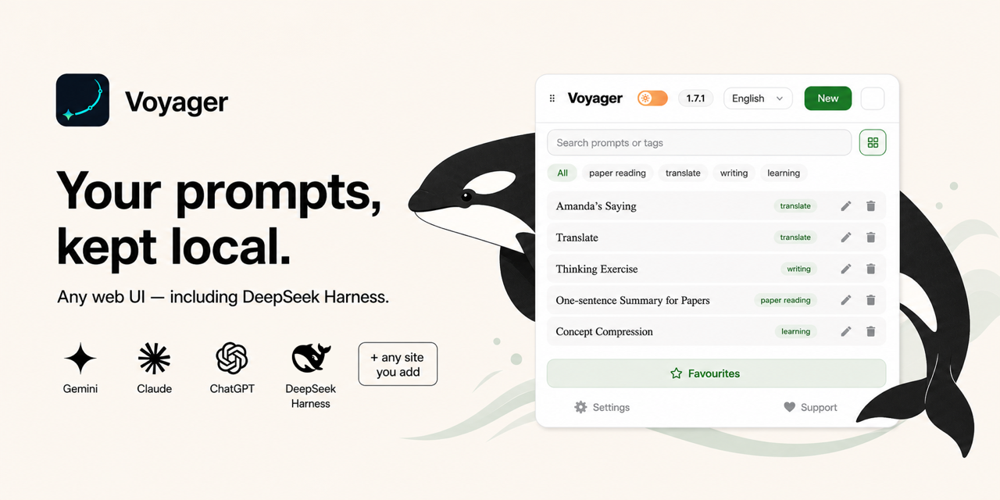
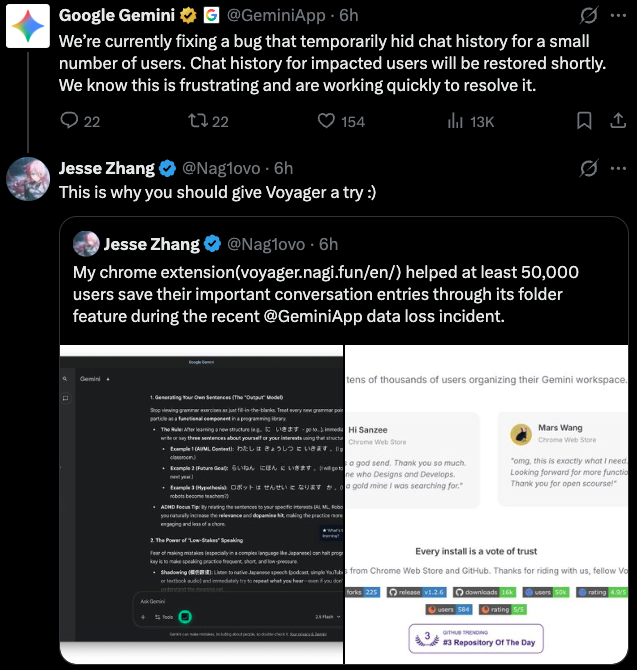
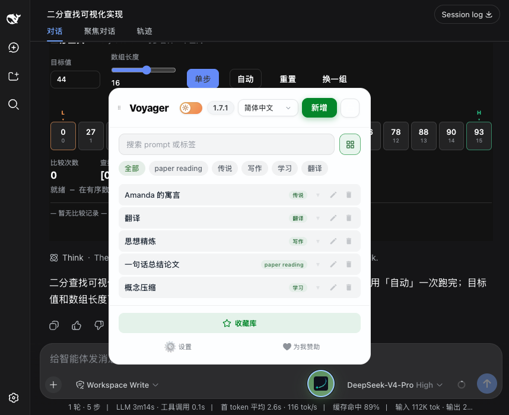

2 月 18 日早上，朋友在群里发了一张截图：他的 Gemini 历史会话列表灰了一大片，点进去全是加载失败。

我赶紧点开自己的 Gemini，心里一紧——这两年的工作记录、调试笔记全在里面，我从来没有导出过。

当天 Google 确认是应用故障，部分用户的历史会话暂时无法访问。晚上我刷 GitHub 找补救工具，看到 Voyager 的 README 里写着一句话：那次事故里，Voyager 的用户在自己建的文件夹里，照常看到了所有保存过的会话。

就凭这一条，我决定把它装上一试。

安装比我想象的简单。Chrome 网上应用店搜 Voyager，点一下「添加至 Chrome」，不用注册、不用付费，前后不到一分钟就出现在工具栏里，版本 v1.7.1。Edge、Firefox 也有对应版本，Safari 版要从 GitHub Releases 单独下载。

装完它没有任何引导页，静悄悄地挂在浏览器上。第一次生效的地方是 Gemini 网页版——左侧多了一组文件夹入口。

中间遇到一个小问题：文件夹面板第一次打开是英文界面，我在设置里翻了一圈才切到中文。整个过程不到五分钟，没报错，也没有遇到网上说的「装完没反应」，刷新一次页面就好了。

接下来是重头戏。我重点测了三样东西：文件夹、提示词库、导出。

第一个是文件夹，这也是它的核心功能。侧边栏出现两级目录层级，拖拽就能归类，还支持自定义文件夹颜色。我建了「工作」「写作」「临时」三个一级文件夹，把散了两年的 200 多条会话一条条拖进去。整理完的那一刻我有点恍惚——这是我在 Gemini 上第一次知道自己到底聊了多少东西。

整理过程中，我发现两个原生 Gemini 没有的能力。一是时间线导航：会话里的消息变成一个个可视节点，点一下直接跳到任意一轮对话，还能给关键节点打星标。之前我找两周前的一个结论要滚动半天，现在一步到位。二是批量删除，再也不用一条条点开删。文件夹还支持云端同步，把分类结构同步到 Google Drive，换台电脑也能接上。

第二个是 Prompt Vault（提示词库）。把常用提示词存进去之后，不只在 Gemini 里能调，AI Studio、任意自定义网站都能用。我做了个实测：在 localhost 上把 DeepSeek Harness 跑起来，在插件弹窗里添加这个页面，提示词库就跟着出现在那个页面上。也就是说，你平时攒的提示词不再被锁死在某一家的网页里。

第三个是导出。我把一个 40 多轮的调试会话导出成 Markdown，图片全部跟着下载下来，公式还能一键复制 LaTeX 源码。这一步给我的安全感最强——就算 Gemini 再抽风，数据已经在本地了。

测试过程中我还撞见了两个原生界面的老毛病：Gemini 的 Markdown 加粗经常失效，模型输出的 **文字** 显示成纯文本；Claude 上中文偶尔渲染错位。Voyager 都给了一键修复开关，打开之后确实正常了。看到这个我是真笑了——官方一时修不动的问题，一个扩展修好了。

我顺手查了这个仓库的底细：2025 年 10 月建仓，TypeScript 写的，GPL-3.0，到今天 19,782 Star、652 fork，open issue 只有 17 个。

这个项目还有两个让我印象很深的地方。

一是它由一个人维护。作者 Jesse Zhang，README 里自称 side project，但完成度很高：文档站、多语言 README、四端扩展齐全。生态已经长出好几个 fork，DeepSeek Voyager、claude-nexus、Better_Doubao，都沿着「时间线导航 + 文件夹管理」这条路线在走。

二是更新节奏很稳。版本记录我翻了：v1.6.0（7 月 18 日）、v1.7.0（7 月 31 日）、v1.7.1（8 月 7 日），基本两周一版，我拉数据的当天仓库还有新 push。这个体量下 issue 只挂着 17 个，维护得很干净。

跑完这一圈，我的感受是：这个工具最值钱的不是功能数量，而是那次事故暴露出来的设计取向——你的会话数据始终在你手里。文件夹、本地存储、导出三件事互相兜底。

如果你也重度用 Gemini、Claude 或 ChatGPT，会话已经多到找不着北，建议你现在就装一个 Voyager。第一件事，把存量会话全拖进文件夹；第二件事，把最常用的提示词存进 Vault，顺手做一次完整导出。十分钟的事，换来的是下次服务再抽风时的心安。

项目地址：https://github.com/Nagi-ovo/voyager

