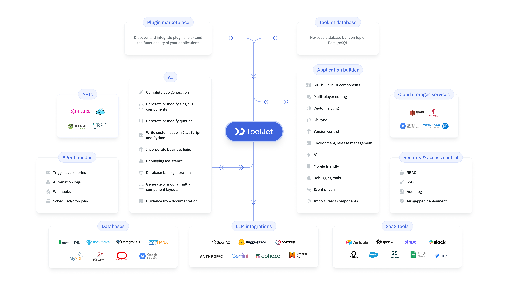

上周五快下班，运营同事又在群里 @ 我："Felix，帮忙做个订单查询面板呗，就几个筛选条件加个表格，很快的。"

我嘴上说好，心里已经在翻白眼。这种"很快的"内部小工具，这两年我手搓了不下二十个：起一个 Next.js 项目、写表格组件、接数据库、配权限、再部署上线，半天起步。每次都想复用点什么，每次都发现场景又变了。

晚上刷 GitHub Trending，看见 ToolJet 一天涨了 798 个 star，总星 40.7K。介绍写着"internal tools, workflows and AI agents"——构建内部工具、工作流和 AI Agent 的开源平台。行，就它了。我倒要看看，拖拽搭内部工具是不是真的比手搓快。

## 一条 Docker 命令，五分钟起服务

README 上给了一条 docker 命令，宣称一条命令就能跑起来。我直接复制进终端：

```bash
docker run --name tooljet --restart unless-stopped -p 80:80 \
  --platform linux/amd64 \
  -v tooljet_data:/var/lib/postgresql/13/main \
  tooljet/try:ee-lts-latest
```

拉镜像花了三分钟左右。有个小坑：M 系列 Mac 必须带 `--platform linux/amd64`，不加的话容器直接起不来，报架构不匹配。

起来之后浏览器打开 http://localhost，第一次进会让你注册管理员账号，填个邮箱密码就完事。没有数据库连接串、没有环境变量文件、没有 nginx 配置，前后五分钟，一整套低代码平台就躺在本地了。说实话比我预想顺利得多，我原以为这种"全家桶"平台本地部署至少要折腾一晚上。



## 拖个表格，接上数据，真的就通了

进到 dashboard 之后，我建了个空应用，打算复刻运营要的那个订单面板。

画布左侧是组件库，60 多个组件：表格、图表、表单、按钮、进度条都有。拖一个 Table 到画布上，右边属性面板配列名、配数据源。本来我准备连公司的 PostgreSQL，结果发现它内置了一个 ToolJet Database——不用写 SQL 的在线数据库，建表靠点点点，字段类型下拉一选就行。我直接在里面建了张 orders 表，塞了几条测试数据。

把表格接上这张表，筛选、排序、分页自动就有了。运营要的"几个筛选条件加个表格"，到这里基本已经完成一半了。

最让我意外的是写代码这件事。组件属性上有个 Run JS 选项，可以直接写 JavaScript，居然还支持 Python。我给表格加了个金额汇总，两行 JS 完事——不用为了一个合计值再去写一个后端接口。

然后我注意到它支持多人协作：同事可以同时打开同一个应用，画布上能互相看到对方的编辑动作，还能在组件上留评论。这个体验跟 Figma 有点像，内部工具的沟通成本一下降下来了。

重点来了——它现在主推的 ToolJet AI。注意这是企业版功能，社区版里没有。三个能力：用自然语言描述需求直接生成应用、AI 辅助写 SQL 和查询、一键定位报错。我在它的 demo 里试了 AI 生成应用，输入"给我做一个库存预警面板，显示低于阈值的 SKU"，它真的生成出来了，表格带图表，改几下就能用。虽然精细度赶不上手写代码，但内部工具本来就不需要精细，能用、快、好改才是王道。

数据源列表我也翻了：80 多个连接器，PostgreSQL、MySQL、MongoDB、AirTable、Slack、S3 基本全覆盖。我试着连了测试库的 PostgreSQL，填个连接串，测试连接通过，数据表直接列出来了。


## 逛 repo 的三个印象

一是协议，AGPL v3.0。这是它敢上 AWS 和 Azure Marketplace 的前提，但想把它改造成 SaaS 卖钱的人要小心传染条款。

二是分支管理用 git-flow，develop 是主力分支。用 git-flow 的团队发布节奏一般都比较稳，我翻了翻 release 记录，迭代确实勤。

三是团队是印度的 ToolJet Solutions Inc，2019 年起步。40K star 里大部分是最近三年涨上来的，社区 Slack 挺活跃。一个"内部工具平台"能涨到这个体量，说明"快速搭内部工具"这个需求是真的又广又痛。

## 我的结论

一圈测下来：如果你团队里三天两头有人让你做"小工具"——数据看板、审批后台、客户查询面板，ToolJet 值得装一个。拖拽五分钟出原型，JS/Python 能补复杂逻辑，多人协作在线改，比手搓快太多。

但它不是银弹。对外的高并发 ToC 产品别用它，需要深度定制 UI 的重应用也不合适，它的主战场就是企业内部几十个人用的那类工具。AI 生成应用的能力目前锁在企业版，想尝鲜可以先用社区版把底子搭好，等团队真的离不开它了再升级也不迟。

项目地址：https://github.com/ToolJet/ToolJet

