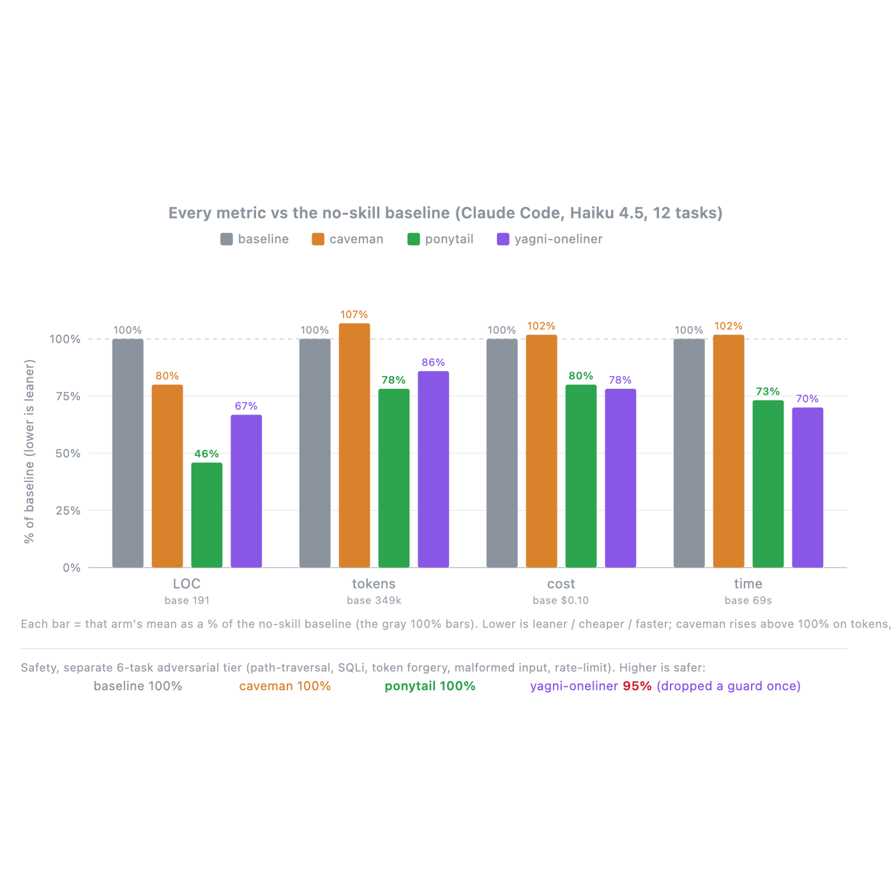

上周让 Claude Code 给我写个日期选择器，它干了这么几件事：装 flatpickr、写了个 wrapper 组件、加了个样式表，然后开始跟我讨论时区处理方案。

我看着满屏代码，就一个想法：兄弟，浏览器里不是有个 `<input type="date">` 吗？

这就是我刷到 ponytail 时被击中的原因。它的介绍只有一句话："Makes your AI agent think like the laziest senior dev in the room"——让你的 AI 像屋里最懒的资深开发一样思考。最好的代码，是你根本没写的代码。110.5K star，今天又涨了 944。行，试试。


## 安装：两条命令，门槛为零

它本质是个跨 agent 的插件，我用的 Claude Code，安装就两条命令：

```
/plugin marketplace add DietrichGebert/ponytail
/plugin install ponytail@ponytail
```

有个小坑：两条命令必须分开两次发，一次发两条它不认。README 特意写了括号提醒，我差点没看见。

装完不用改任何配置文件，默认就是 full 档位。如果你用的不是 Claude Code 也没关系——它支持 20 个 agent：Codex、GitHub Copilot CLI、Gemini CLI、OpenCode、Devin、Grok，甚至还有 Hermes Agent，每个平台就一两条命令的事。装完重启会话，一个叫 `/ponytail` 的命令就出现了。

## 核心机制：一个"七级懒人阶梯"

它解决问题的思路特别简单，就是给 AI 写代码前塞了一个决策阶梯，七个台阶从懒到勤：

1. 这东西真的需要存在吗？不需要就跳过
2. 代码库里已经有了？复用，别重写
3. 标准库能干？用标准库
4. 平台原生功能有？用原生的
5. 已经装了的依赖能解决？用它
6. 一行代码能搞定？就写一行
7. 都走完了，才允许写"能跑的最小实现"

妙的是顺序：这个阶梯是在 AI **理解完问题之后**才走的。它必须先读代码、跟真实调用链，然后才决定站哪个台阶。懒的是解决方案，不是阅读量——这句话我觉得是它和"让 AI 少写点"这类提示词的本质区别。

装上之后我拿同样的日期选择器任务测了一遍。它没装任何东西，输出就一行：

```html
<!-- ponytail: browser has one -->
<input type="date">
```

然后我又跑了个 /ponytail-review，让它审一遍我最近一个 PR 的 diff。它逐条列出了可以删的东西：一个我重复实现了两次的格式化函数、一个代码库里已经有 utils 的校验逻辑、一个为了"以后可能用到"提前抽的抽象层。每条后面都写着理由和删除建议。说实话，删代码的冲动都被它勾起来了。

## 数据：不是玄学，是真测过的

看完它的 benchmark 我才认真起来。不是那种"prompt 里写一句少写代码"的玄学，是真金白银的对照实验：headless Claude Code 去改一个真实开源仓库（FastAPI + React 的 full-stack-fastapi-template），12 个 feature 任务，每组跑 4 次取平均，用的还是 Haiku 4.5 这种小模型。

结果：装与不装对比，**代码行数 -54%**（遇到过度构建的陷阱任务最高能到 -94%），token -22%，成本 -20%，耗时 -27%。

最让我在意的是最后一行数据：安全性 100%。对照组里手写"YAGNI + 只写一行"提示词的方案，代码也少了 33%，但安全性掉到 95%——因为它把该有的校验也删了。ponytail 的规则里写死了：验证、错误处理、安全、可访问性永远不在裁剪名单上。它删的是过度设计，不是工程质量。

这也解释了它为什么敢把"每删一行代码"写成机制而不是口号。



## 几个印象深的细节

一是它的口气。README 和 FAQ 全程用"他"称呼这个虚拟的资深开发："He says nothing. He writes one line. It works."（他什么也不说，写一行代码，能跑）。有人问"如果我真的需要那个 120 行的缓存类怎么办？"回答是："You don't. Insist anyway and he'll build it. Slowly. Correctly. While looking at you."这种项目文案我是真没见过。

二是适配矩阵的工程量。20 个 agent 的安装方式、hooks 注入、always-on 规则文件全都有对应适配，连 OpenClaw 和 Hermes 这种都有。维护这个适配层的工作量不比规则本身小。

三是它跟 caveman 的关系。caveman 是让 AI 少说话，ponytail 是让它少写代码，官方说两者可以一起用、互不重叠。作者对竞品的态度也挺有意思，benchmark 里直接拿对方做对照组，数据摊开给你看。

四是诚实。早期它宣传"代码减少 80-94%"，后来有人 issue 指出裸模型基线不公平，它就重做了整套 agentic benchmark，把数字修正成 -54%，还在 README 里原原本本讲了这段黑历史。

## 我的结论

如果你在用任何 coding agent，这个插件值得装。成本几乎为零，效果立竿见影：代码更少、review 更快、token 更省。特别适合两种情况：被 AI 生成的"勤奋型屎山"折磨的人，和给团队制定 AI 编码规范的负责人——那个七级阶梯直接就能拿去当规范用。

一个注意点：它对小模型和普通模型效果最好，README 自己说 terse 推理模型（比如 GPT-5.5）可能因为思考 token 花在琢磨阶梯上反而变贵。另外它不是银弹，代码已经写得极简的地方它帮不上忙——不过那种地方，也不需要帮忙。

> 🔗 项目地址：https://github.com/DietrichGebert/ponytail

