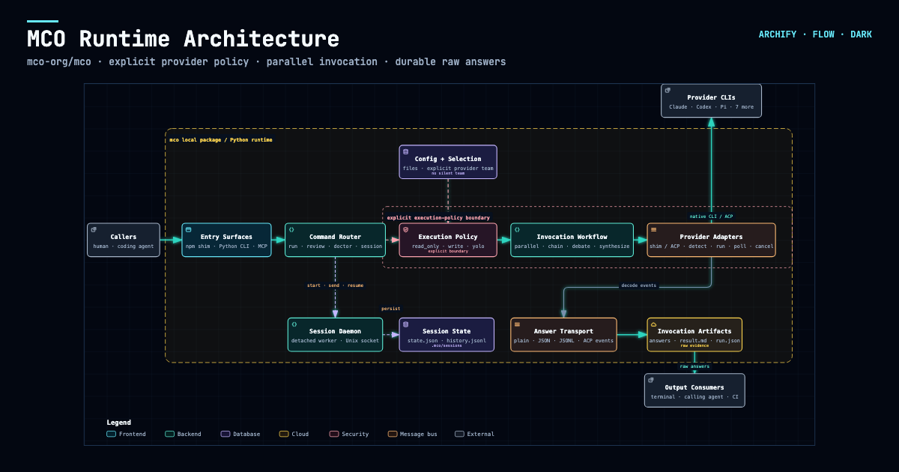
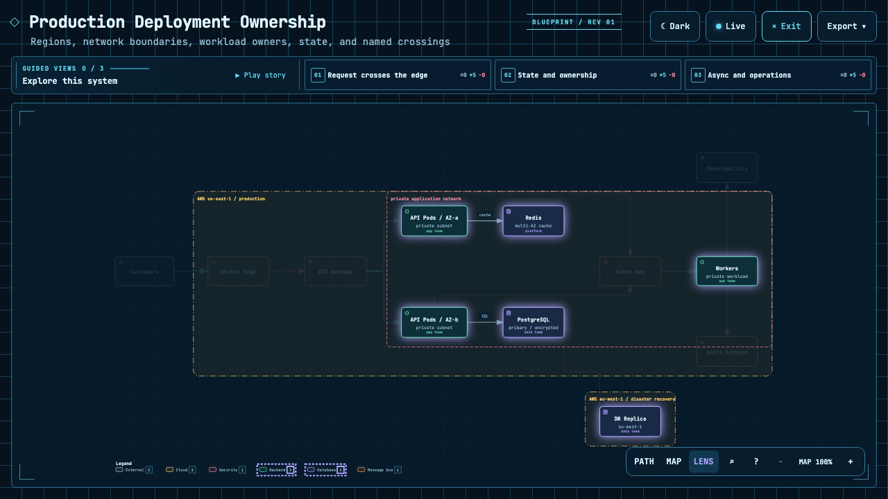
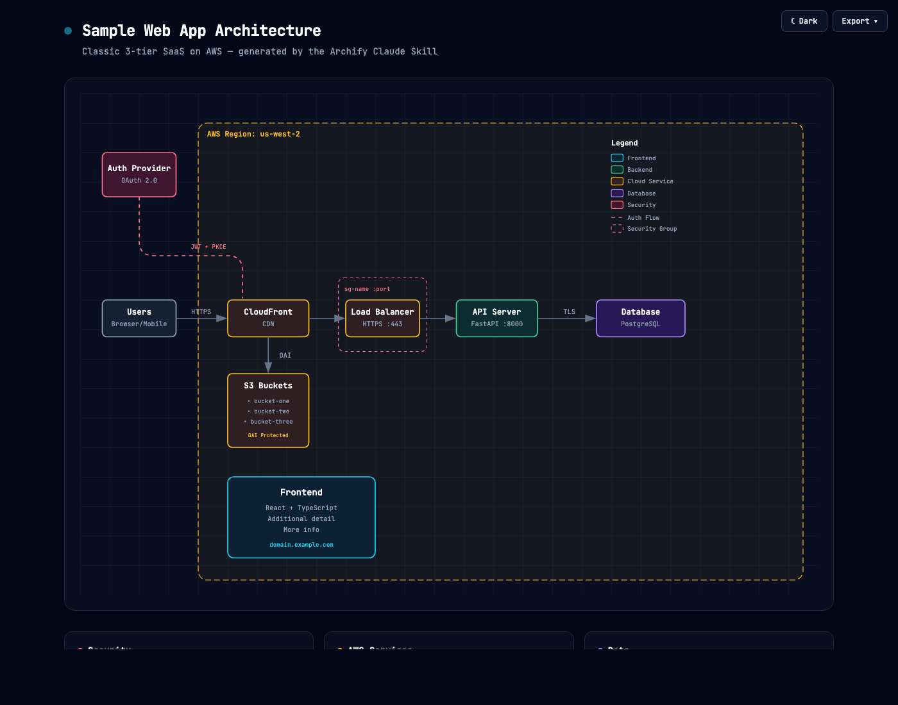

上个月架构评审，我让 Claude Code 画一下我们网关服务的调用拓扑。它给了我一坨 Mermaid——布局乱成一团，线交叉得像意大利面，导出 PNG 还糊。最后我还是打开了 draw.io 手画。那天我在想：AI 写代码已经这么强了，怎么画个架构图还是这么拉胯。

今天刷 GitHub Trending，看见 archify 一天涨了 1035 颗星，总星 18.6K。介绍写着："Turn a codebase or system description into a polished, interactive system map — directly in chat."——在对话里，把代码库变成可交互的系统地图。就是它了，装。

## 一条命令装好，直接开画

安装出奇地简单，就一条命令：

```bash
npx skills add tt-a1i/archify -g
```

它本质是个 agent skill，支持 Claude Code、Cursor、Codex CLI、OpenCode、Raven 五个平台。我装在 Claude Code 里，装完不需要任何配置。

然后就是一句话的事："Use archify to map this repository's runtime architecture."

我拿了一个最近在改的 Python 服务仓库做测试。Agent 读代码库，几十秒后甩给我一个 HTML 文件。打开的那一瞬间说实话有点意外：深色主题的交互式地图，节点分布有序，还能拖拽、缩放。我点了一个服务节点，它弹出了这个节点的上下游调用关系，再点一下，直接跳到了源码文件。跟之前那种"画完就死"的静态图完全是两个物种。



## 五个图型，和让人眼前一亮的变更对比

它支持五种图：架构图、工作流图、序列图、数据流图、生命周期图。四个预设模板，暗色亮色两套主题，还内置了品牌标记。我重点试了两种：

**架构图**：让它画网关服务的整体架构，它把入口、认证、路由、下游服务的依赖关系理得很清楚。最打动我的是"不编造"——README 里管这个叫 grounded，就是图里的每条边都能追溯到真实的代码引用。我之前被 AI 幻觉式的架构图坑过（画出一个根本不存在的服务），所以特别在意这点。它生成的图带一个验证机制，节点和连接都经过检查，源码链接是 revision-verified 的。

**变更对比**：这个功能我得单独说。给它两个 commit，它会生成 Before / Delta / After 三视图，精确列出新增、删除、修改、移动、重路由的节点和边。我拿服务拆分前后两个版本试了一下，Delta 视图里清清楚楚标出哪些服务是新拆出来的、哪些调用被重路由了。以前架构变更 review 全靠人肉 diff 眼睛找，这个直接把答案摆出来了。



其他的：导出支持 PNG、SVG、WebM，还有 1200×630 的分享卡片（发飞书群刚好用）。文件是单个自包含 HTML，发给同事不用装任何东西，浏览器打开就能交互。



## 逛 repo 的三个印象

一是迭代速度。当前版本 v2.16.0-dev.0，Changelog 一直滚到"未发布"条目，这个节奏说明作者在持续高频迭代。

二是文档做得讲究。项目主页有完整的 Scenario guide 和 Proof Lab（画廊），每个 agent 平台都有专属的快速开始页面，连 Cursor 的参数都帮你拼好了。开源项目做到这种文档水准的不多。

三是它的定位很克制。它就是"架构可视化"这一件事，不碰代码生成、不碰监控，MIT 协议，用 skill 机制挂进你的 agent，轻量到没有存在感。上一个把单点功能做到这个完成度的，是 caveman。

## 我的结论

如果你经常需要画架构图、做变更评审，或者带新人 onboarding 时讲系统结构，archify 值得装。一句话出图、可交互、可验证、单文件分享，这些点单拎出来不稀奇，合在一起就是目前 AI 画图方案里体验最好的一个。

但它不替代深度架构文档：复杂的时序细节、设计决策的"为什么"，还是需要人写。它的强项是快速建立结构认知和变更 diff。如果你是 Cursor 用户，去它主页用 agent-aware quick start，参数都帮你选好了。

项目地址：https://github.com/tt-a1i/archify

